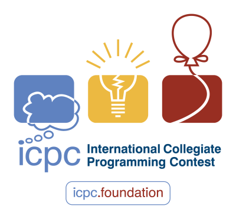
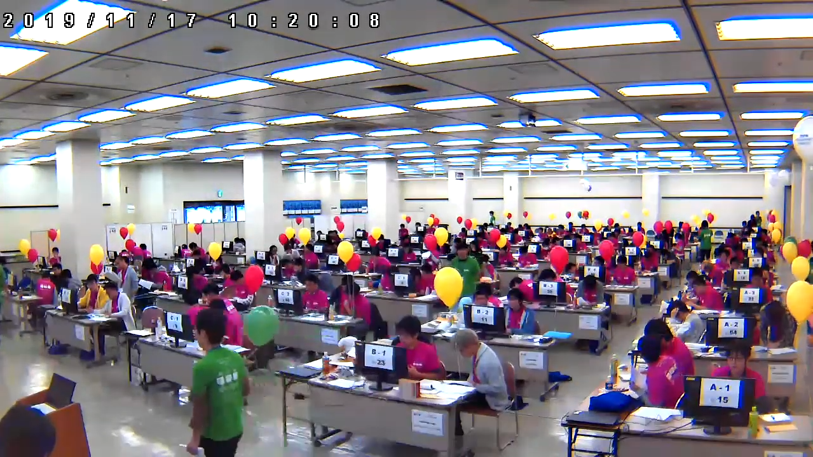

# ICPCへのお誘い

Asa

## はじめに

こんにちは、第3期生の土屋です。
2021年3月に古河中等教育学校を卒業し、現在は埼玉大学工学部情報工学科に所属しています。
この度、細島部長にお声がけいただき、このような形で部誌の編集に携わることとなりました。

技術系（特にプログラミング関連）の記事がほとんどである、この部誌を読んでくださっている方の中には、「競技プログラミングについて聞いたことがある / すでに参加している」という方がいると思います。そこで、国際大学対抗プログラミングコンテスト（ICPC）に関する記事を書きたいと思います。

## ICPCってなに？

国際大学対抗プログラミングコンテスト（International Collegiate Programming Contest・通称 ICPC）https://icpc.global/ （日本語版: https://icpc.iisf.or.jp/ ） は、同じ大学の3人で1チームを作り、プログラミングの問題を解く大会です。中学生・高校生の皆さんは、「国際情報オリンピックのチーム参加版」と捉えていただけるとわかりやすいかもしれません。

{width=200}

この大会には世界各国から毎年3万人以上が参加しており、日本からも様々な大学から参加しています。2021年度、私の所属する埼玉大学からも2チーム出場し、私もそのうちの1チームに参加していましたちなみに私のチームの結果は、予選43位、アジア大会11位でした。もう1チームは予選104位で、アジア大会に進出できませんでした。。

大会の流れとしては、「国内予選→アジア地区大会→世界大会」といった流れです。情オリに似てますね。国内予選では3時間で6-7問、アジア大会では5時間で10問程度の問題を解きます。情オリとは違い、得点ではなく、解いた問題数で競います。また、アジア大会で利用できるコンピュータもチームで1台と制限があります2020年度・2021年度はオンラインだったため、1人1台でした。そのため、チームで知恵を出し合い、自分が解けそうな問題は積極的に解いていく、ということが重要になります。

{width=400}

## どんな問題を解くの？

「○○くらいの難易度です！」と言っても個人差があると思うので、実際に出された問題を見てみましょう。

### 2021年度 国内予選 A問題

to do

### 2021年度 アジア大会 A問題

to do

