# キーボードが欲しかったので自作してみた

Nagaso.cpp

## はじめに

知っている人はこんにちは。知らない人もこんにちは。6期生のNagaso.cppです。
今回は初めて自作キーボードに挑戦してみました。元々何かしらのハードウェアを自作してみたいなと思っていて、本当はPCを自作するつもりでしたが予算が足りなさ過ぎて断念しました。代わりに、PCと同じく欲しいと思っていたキーボードを自作することにしました。自作というものはなかなか面白いもので、今回はその楽しさを皆さんにもぜひ知ってもらいたく、ここに記すことにします。

## 必要なパーツについて

ここでは、今回購入したパーツを紹介します。パーツはすべて台東区にある遊舎工房という自作キーボード専門店の実店舗で購入しました。ホームページから通販で購入することもできます。https://shop.yushakobo.jp/パーツ選びにあたっては、ほぼすべて店員の方が手伝って下さいました。ありがとうございました。実店舗だと店員の方に相談すれば間違いないのがいいですね。おすすめです。

さて、キーボードは、**PCB基板**、**スタビライザー**、**キースイッチ**、**キーキャップ**、**ケース**、**プレート**の5つのパーツから構成されます。それぞれ併せて解説します。

### PCB基板

名前通り基盤です。これに後述のパーツを取り付けていきます。基盤は、日本で使われている日本語(JIS)配列用と、海外で使われている英語(US)配列用の二種類があります。今回はUS配列用のもので、普段私たちが使い慣れているものとは若干キーの配列が異なります。また、US配列の中にも配列の種類が種類が二つあり、基板によって対応する配列が異なります。

さて、今回は **DZ60 REV 3.0 type-c** というものを購入。よくあるゲーミングキーボードのようにピカピカ光らせることができるタイプになります。また、この基盤は60%サイズとなっていて、テンキーや矢印キー、ファンクションキーなどがないコンパクトなタイプになります。ちなみに、設定をすることでこれらのキーは他のキーに自由に割り当てることができます。  
商品ページはこちら↓  
https://shop.yushakobo.jp/products/dz60?variant=37665274855585

{width=250}

### スタビライザー

このパーツは、PCB基板に取り付けることで、スペースキーなどの横に長いキーを支える役割をします。金属棒が使われているため、キーを押下したときに若干金属音が鳴る場合がありますが、高品質なものを使ったり、潤滑剤を塗ったりすることで改善できます。~~私はお金がなくてケチりました。~~  
商品ページはこちら↓  
https://shop.yushakobo.jp/collections/all-keyboard-parts/products/a0500st

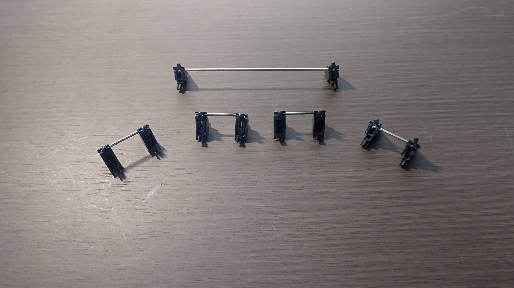{width=250}

### キースイッチ

各キーのスイッチ部分です。今回はメカニカルキーボードと呼ばれる種類のキーボードに使われるものになります。スイッチの種類によって真ん中のスイッチ部分（今回であれば白い部分）の色が異なり、打鍵感も様々なものがあります。Cherry社の「赤軸」「青軸」「茶軸」「黒軸」などが有名ですね。そのほかにも様々な会社が独自のキースイッチを開発・販売しており、その種類数はゆうに100を超えます。そのため、スイッチ選びは自作キーボードの醍醐味の一つと言えます。

今回は**Tecsee**社の**Blue Sky Switch**をチョイス。Cherry社の茶軸に似たばねの重さと、青軸のようなクリッキー感を持ち合わせたもので、実店舗で様々な種類のスイッチを比べたうえで、この打鍵感がとても好きだったので選びました。  
商品ページはこちら↓  
https://shop.yushakobo.jp/collections/all-switches/products/3973

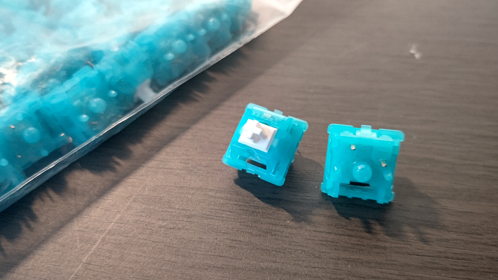{width=250}

### キーキャップ

普段私たちがタイピングをするときに、指に触れる部分です。キースイッチに取り付けます。自作キーボード用のキーキャップもまた様々なデザインがあり、このキーキャップ選びもまた自作キーボードの醍醐味のひとつです。塗装してオリジナルのデザインを作る人もいます。今回は、**PG PBT Macaron Keycaps set** をチョイス。結構おしゃれな感じのものを選びました。  
商品はこちら↓  
https://shop.yushakobo.jp/collections/keycaps/products/pg-pbt-macaron-keycaps-set

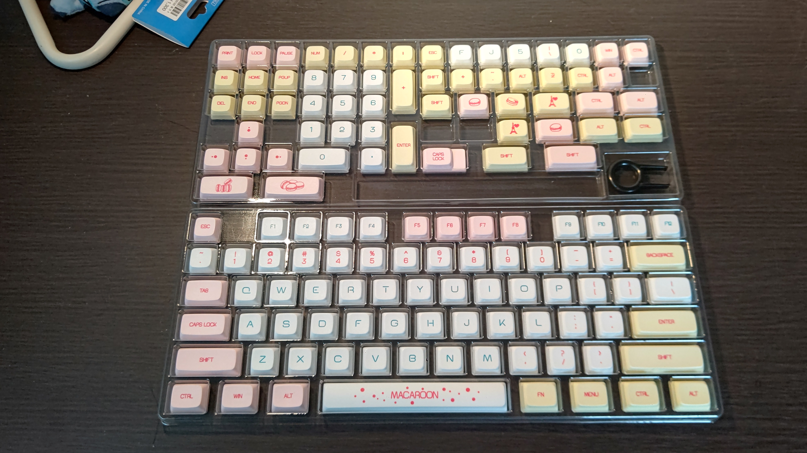{width=250}

### ケース

PCB基板にいろいろ取り付けた後、それをはめ込むケースです。材質はいろいろありますが、今回は~~ケチって~~節約して安めのプラスチックのものにしました。基板の大きさにあったものを買わないと基盤がはまらなくて悲惨なことになるので気をつけましょう。今回の基盤は60%のものなので、60%用のを購入。  
商品はこちら↓  
https://shop.yushakobo.jp/collections/case/products/60-plastic-case

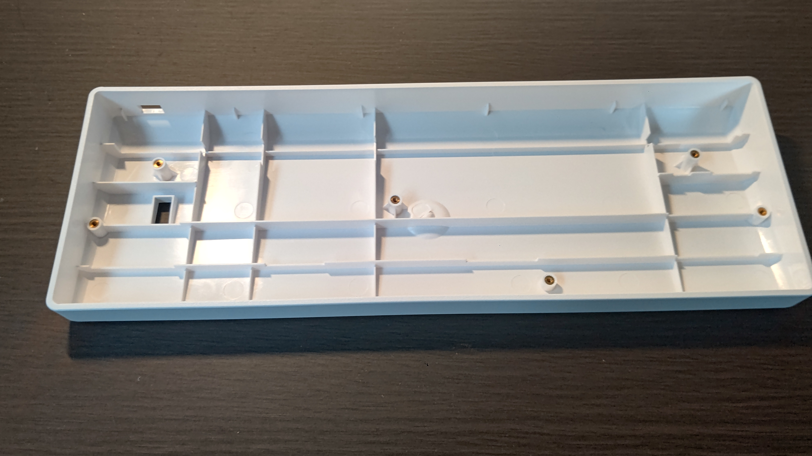{width=250}

### プレート

キースイッチを固定・安定させるための部品です。

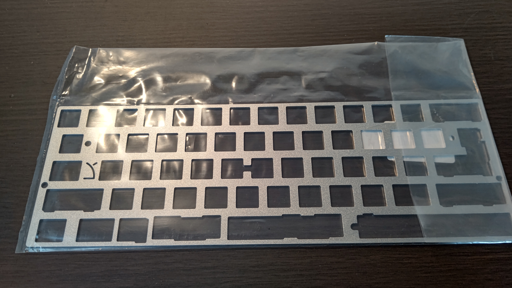{width=250}

また、今回の制作にあたっていくつか工具が必要なので、それも紹介します。

### はんだごて一式

キースイッチを基板に取り付ける際、はんだづけが必要はんだづけが不要なものもありますが、基盤が対応している必要があります。今回は非対応です。なため購入しました。
セラミックヒーターで、かつ温度調整が可能なものが望ましいです。こて台が付属していない場合は、安全のため購入しておくことをお勧めします。

はんだは、プリント基板用の直径0.8mmのものを購入しました。あとは、失敗したとき用に吸い取り線があると安心です。

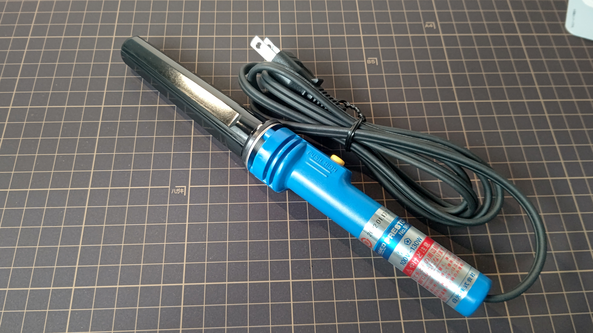{width=250}

### その他工具

潤滑剤とカッターマットを購入。潤滑剤は筆で塗るタイプが好ましいです。また、ドライバーが基板のねじ止めの際に必要です。ドライバーは家にあったのでそれを使用しました。

## 組み立て

さて、いよいよ組み立てに入ってきます。まず最初に、基板にいろいろ取り付けていきます。

### スタビライザーに潤滑剤を塗る

前述の通り、タイピング時に金属音が鳴るのを軽減するため、一度スタビライザーを分解してから、金属部分に潤滑剤を塗っていきます。本当はキースイッチも分解して潤滑剤を塗るといいそうですが、キースイッチを分解する道具を買っていなかったので今回は塗っていません。~~一度潤滑剤を倒してしまいあわや大惨事になりかけたのは内緒~~

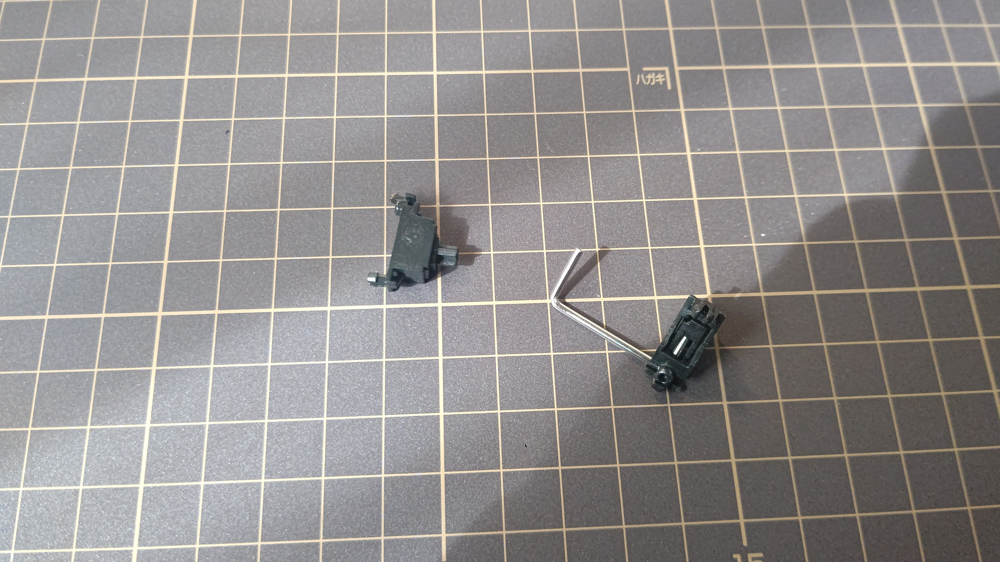{width=300}

### スタビライザーを基板に取り付ける

スタビライザーのプラスチック部分の爪を、基板の小さな穴に押し込みますねじ止めタイプの場合はねじ止めします。今回は爪タイプです。。取り付ける位置は基板の取扱説明書などに書いてあるのでそれを参考にします。意外と力がいるので、基盤を折りそうになりますが、折らない程度に思い切りよく押し込むと上手くいきます。スタビライザーは、取り付け位置によって上下の向きが異なるので注意します。

{width=250}

### プレートとキースイッチを基板に取り付ける

上下の向きに気を付けつつプレートを基板に取り付け、キースイッチを取り付けていきます。キースイッチの裏側にある5本の爪と基板の穴の位置が合うように、また取り付け位置は基板の取扱説明書やプレートの穴を参考にします。

{width=250}

{width=250}

### キーキャップを仮で取り付ける

特に横に長いキーは、スタビライザーやキースイッチの位置を間違えると隣のキーと干渉してキーキャップがはまらない可能性があるため、一部を仮で取り付けてみて干渉しないか確認します。大丈夫そうなら、外して次の工程に移ります。

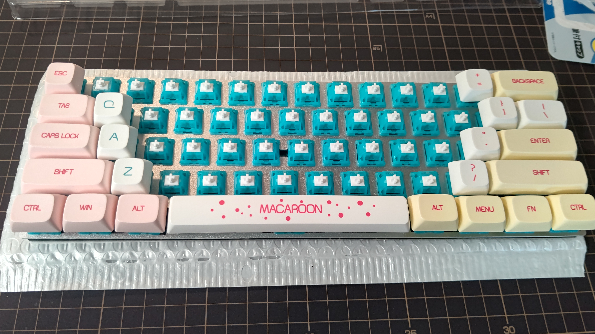{width=250}

### キースイッチをはんだ付けする

基板の裏から出ている、各スイッチの2本の金属の爪にはんだ付けをしていきます。はんだ付けをしたのは前期生の技術の授業でやったとき以来なので、コツを掴むのに苦労しました。~~というかコツ掴んでない~~

こて先が熱すぎるとはんだが蒸発？したので、適宜こて台のスポンジで冷やすようにするといい感じになります。

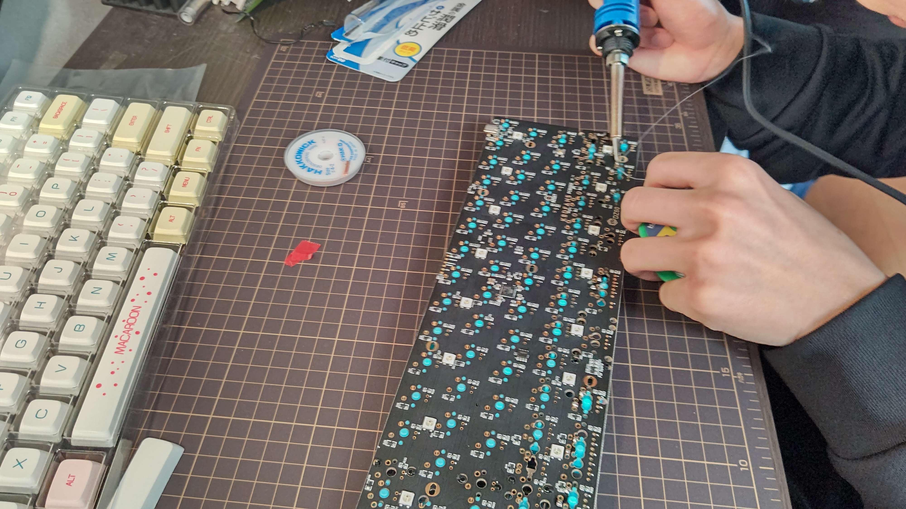{width=250}

### キーキャップを取り付ける

各スイッチにキーキャップを取り付けていきます。キーキャップの穴の部分を、キースイッチの先端の突起に押し込んではめます。日本語配列とは配列が異なるので、「USキーボード 60%」等でググって配列を確認しながらはめていきます。スタビライザーとキースイッチの両方が下に来るスペースキー、Enterキーなどは、キースイッチとスタビライザー両方の突起がキーキャップの穴に取り付けられるようにします。

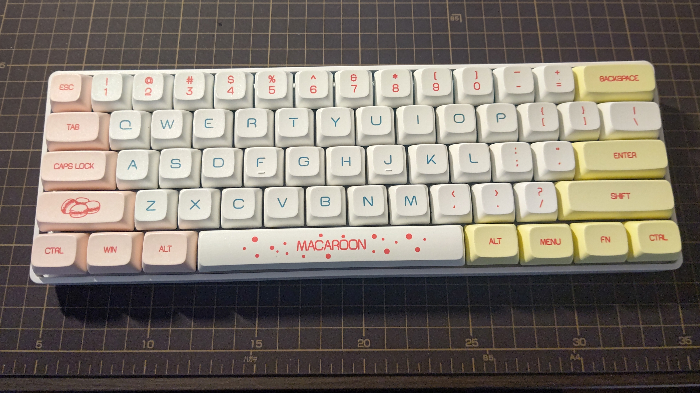{width=300}

### PCにつないで動作確認をする

今回は、キーボード側の端子がType-Cなので、それに対応したコードを使います。家に数本余っていたのでそれを使います。ちなみに100均のを使うと接続が安定しなかったので、ちゃんとしたものを使っています。基板のLEDが光って、PC側で入力がしっかりできていればとりあえずはOKです。光っている様子は後ほど。

入力ができているかの確認は、ネットでもできるし、専用のソフトもあるのでそれを使うといいでしょう。今回は**VIA**と呼ばれるソフトを使いました。画面上のタブから**KEY TESTER**を選択し、任意のキーを押すと、認識されればそれに対応するキーが赤色に変わります。今回は、右シフトキーなどが矢印キーとして認識されていたため、それの修正をしていきます。

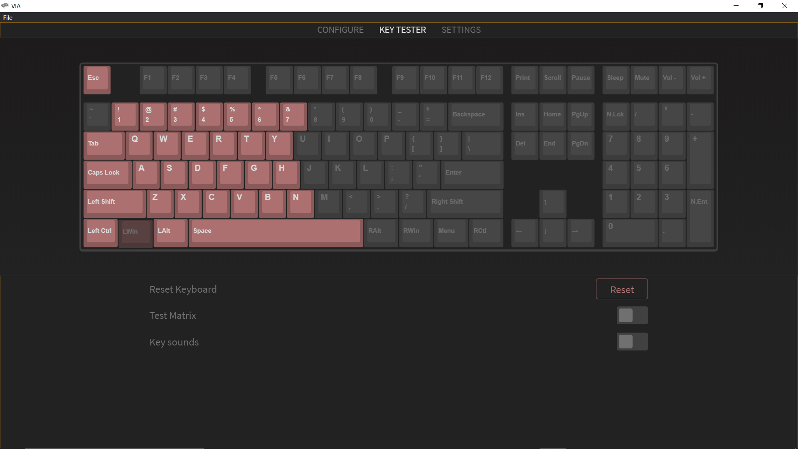{width=300}

### キーマップを変更する１

内部的に認識されているキーの配置（キーマップ）を変更し、実際の配置との齟齬をなくしていきます。先ほど使用したVIAで修正することができます。画面上のタブから**CONFIGURE**を選択します。画面上半分にあるキーボードのイラストから、変更したいキーを選択し、画面下半分のキー一覧から、そのキーに新たに対応させたいキーを選択すると、キーマップを書き換えることができます。

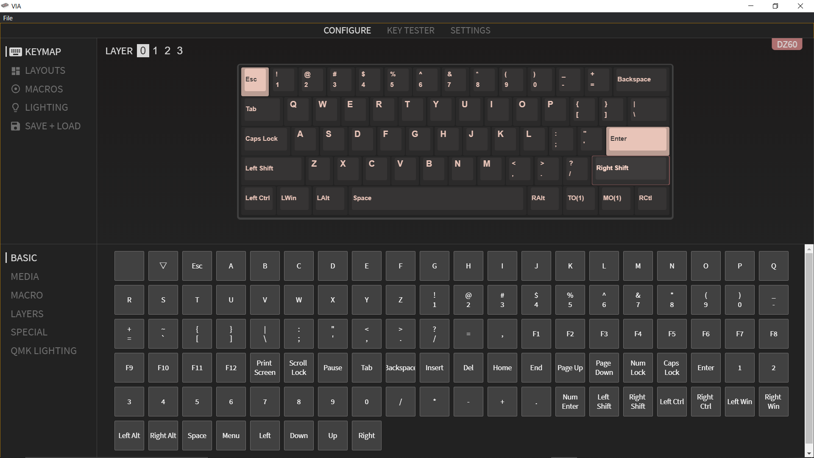{width=300}

### キーマップを変更する２

60%キーボードには、ファンクションキー（F1、F2...）や矢印キー等が存在しないため、このままではただの使いにくいキーボードになってしまいます。そこで、キーマップにレイヤーを追加して、これらのキーを使えるようにします。この作業が、自作キーボードの一番のミソだと思います。

#### レイヤーを編集する

画面左上の**LAYER**の数字を選択することでそのレイヤーの編集画面に映ることができます。先ほどの修正過程で書き換えたのはレイヤー0ですので、レイヤー1を選択します。すると、 画面上半分のキーボードのイラストが、何も書いていないまっさらな状態になります（画像はレイヤー2）。これに、先ほどの修正過程と同じ手順でキーを割り当てていきます。今回割り当てたのは、左側の主要ななキーと、矢印キー、記号キー、Print Screenキー、Deleteキー等です。

#### レイヤーを移動するキーを設定する  

このままでは一つのレイヤーしか使えないので、複数のレイヤーを移動できるようにキーを設定していきます。使用するのは**MO()キー**と**TO()キー**です。()の中身がレイヤーの番号と同じものを使います。MO(n)キーはそのキーを押している間n番目のレイヤーに移動し、TO(n)キーは一度押すとずっとn番目のレイヤーに移動したままになります。レイヤー0の右のMENUキーとFNキーは特に使わないのでこれに割り当てます。レイヤー0からレイヤー1に移動させたいのでどちらも()の中身が1であるものを使います。また、TO(1)を使用したときにレイヤー0に戻れるようにしたいので、レイヤー1にTO(0)を割り当てておきます。これでレイヤーを活用して、存在しないキーを使えるようにすることができました。

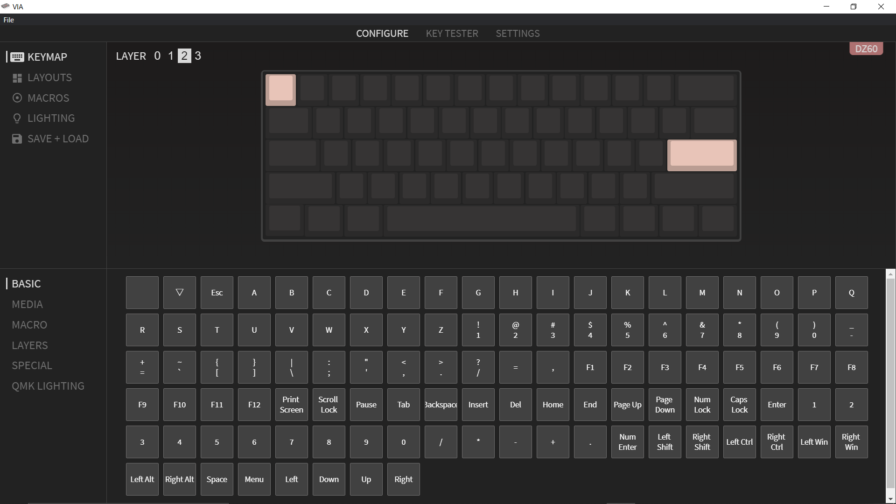{width=300}

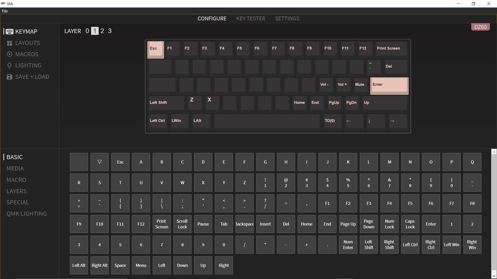{width=300}

## 完成！

これにて初の自作キーボード、完成となります。ちなみに、光り具合もVIAで調整することができます。  
初めてのハードウェア自作でしたが、ほぼ何事もなく無事完成させることができてとてもうれしくおもいます。この記事も今回製作したキーボードで書きましたが、打鍵感も打音も最高で、大満足です。~~財布の中身は空っぽになりましたが。~~ そしてなにより、ずっと挑戦してみたかった自作が実現したのが本当に夢のようで、とても楽しかったです（急な語彙力喪失）。次はお金をためてPC自作にも挑戦してみようかな。

キーボードの自作は、突き詰めれば何も技術はいらず、お金さえあれば誰でも気軽に作れると思うので、皆さんもぜひ自作してみてください。

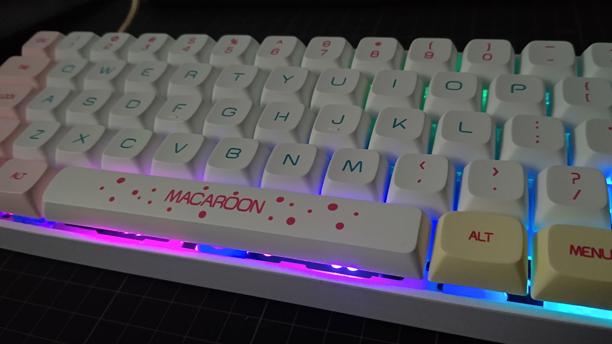{width=300}

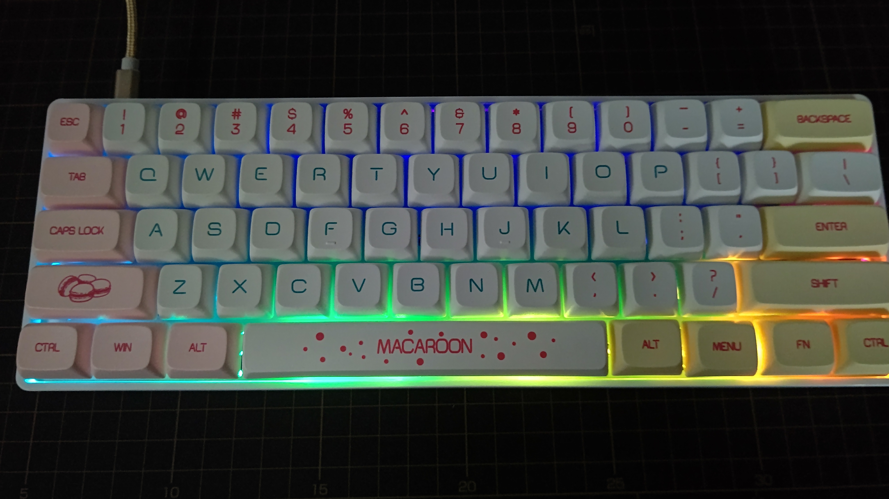{width=300}

## 余談

キーマップの書き換えについてですが、当初はキーマップをウェブサイトで作成し、それをファームウェアと呼ばれる、ハードウェアの処理をつかさどる部分に書き込む方法で行っていました。その書き込みでやらかしてしまい、キーは効かず基板も光らずで、ただの文鎮と化してしまいました。何時間も格闘したのに直らずへこんでいたところ、その状態から、我らがPC部部長**Ryoga.exe**がほんの数十分で直してくださいました。部長には感謝してもしきれないので、この場を仮でお礼させていただきます。ありがとうございました。ちなみに原因は単に書き込みがうまくいっていなかっただけでした。~~クソが~~

## 余談２

パーツを店舗で購入した際、レシートの代わりに領収書を受け取ったので、キースイッチがなんのものなのかわからなくなってしまいました。小一時間インターネットを探し回っても見つからなかったので、自作キーボード界隈では有名なYouTuberの**ららぽん**https://twitter.com/rarapon_exeさんという方のTwitterのDMに突撃したところ、何と一瞬で見つかりました。この記事を書ききれたのもららぽんさんのおかげなので、この場を借りてお礼させていただきます。ありがとうございました。

## Special Thanks

- 遊舎工房
- ジョイフル本田
- rarapon/ららぽん
- Ryoga.exe
- この記事を読んでくださった方々
